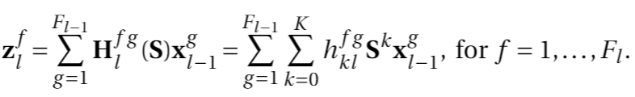

# Graph-Adaptive Activation Functions for Graph Neural Networks
This is a PyTorch implementation of graph-adaptive activation functions for Graph Neural Networks (GNNs). For any questions or suggestions, please e-mail Bianca Iancu at <bianca.iancu026@gmail.com> or Elvin Isufi at <E.Isufi-1@tudelft.nl>.

When using part of this code, please cite the following paper

Bianca Iancu, Luana Ruiz, Alejandro Ribeiro, and Elvin Isufi, "Graph-Adaptive Activation Functions for Graph Neural Networks". *IEEE International Workshop on MACHINE LEARNING FOR SIGNAL PROCESSING (MLSP 2020)*, IEEE, September 21-24, 2020.

Other paper on GNNs by the authors is

Bianca Iancu, and Elvin Isufi, "Towards Finite-Time Consensus with Graph Convolutional Neural Networks". *28th European Signal Processing Conference (EUSIPCO 2020)*, IEEE, January 18-22, 2021.

1. [Introduction](#intro)
2. [Graph-Adaptive Activation Functions](#ga)
3. [Code](#code)

## 1. Introduction

We consider data represented on a graph with N nodes and M edges. On the vertices of the graph, we define a graph signal **x** whose *i*th component is the value at node *i* in the graph. We consider applications where graph signals are processed in a *distributed* fashion. A typical example is in sensor networks without access to a centralized processing unit and where each sensor communicates only with its neighbor sensors. 

Associated to the graph is the shift operator (GSO) matrix **S**, whose sparsity pattern matches the graph structure. That is, **S**  has non-zero values only for the entries associated to edges in the graph. Commonly used GSOs include the adjacency matrix, the graph Laplacian, and their normalized and translated forms. The choice for the GSO varies depending on the application, and different choices have different trade-offs. For our experiments, we employ the adjacency matrix as the GSO. The main operation carried out by the GSO is the shifting of a graph signal **x** over the graph, that is

where **x**(1) is the signal shifted once by the GSO **S**. Specifically, the shifting operation results in neighboring nodes exchanging information and each node aggregating the incoming information from its one-hop neighbors. An essential property of the GSO is its readily distributed implementation, as the shifting operation only employs information that is locally available at each node.

Based on the GSO **S**, we can further define graph convolutions. These are graph filters that can be written as a polynomial of the GSO **S** as

where **h** = \[h0, ..., hK\]T is a vector of coefficients. Since **S** has a local implementation, graph filters are local as well. Thus, they can be run distributively.

By employing graph convolutions, we introduce next Graph Convolutional Neural Networks (GCNNs). These are composed of L convolutional layers. Each convolutional layer consists of two fundamental elements: a linear and a nonlinear component. The linear component comprises a collection of graph filters to perform graph convolutions. Specifically, at layer *l*, the GCNN takes as input Fl-1 features {**x**l-1g}g=1Fl-1 from layer *l-1* and produces Fl output features {**x**lf}f=1Fl. Each input feature **x**l-1g is processed by a parallel bank of Fl graph filters **H**lfg(**S**). The filter outputs are aggregated over the input index *g* to yield the *f*th convolved feature as 

The convolved feature is a graph signal and it is subsequently passed through the nonlinear component of the GCNN, namely an activation function, to obtain the *f*th convolutional layer output as

The resulting output of the *l*th layer serves as the input to the next convolutional layer. These steps are followed recursively until the last layer of the GCNN. The features from the last convolutional layer are further combined by means of a fully-connected to obtain the final GCNN output.

In these experiments, we employ a distirbuted GCNN architecture, illustrated below. Specifically, the graph convolutionl filters are distributable, we employ activation functions that allow for a distributed implementation and we define the fully-connected layer *per-node*. The parameters of the latter are shared for all the nodes, so their number is independent of the graph size.

A unique characteristic that graph data encompass is the coupling between the data and the underlying graph structure on which these data are defined. In the current literature, this coupling is only captured in the linear GCNN component. However, activation functions are crucial in learning nonlinear relations in the data. We argue that it is essential to capture the data-graph topology coupling in the GCNN nonlinear component as well. To address this, we propose a new family of activation functions, which adapt to the graph structure, capture the data-graph topology coupling in the neighborhood of a node, and allow for a distributed implementation.

## 2. Graph-Adaptive Activation Functions

We propose a family of activation functions for GNNs that account for the data-graph topology coupling, while also being distributable. Specifically, we define them similarly to graph convolutions. This allows capturing information from neighborhoods or arbitrary size, while the nonlinear aggregation is locally applied within one-hop neighborhoods. The resulting nonlinear features are combined with a set of trainable parameters to weigh the information at different neighborhood resolutions accordingly. The resolution radius is a user-defined parameter and allows the GNN to adapt to the task at hand. We define two new types of activation functions, namely *graph-adaptive localized activation functions* and *graph-adaptive kernel activation functions*. 

The graph-adaptive localized activation functions are implemented in terms of a nonlinear operator, employed within the one-hop neighborhood of each node. Specifically, we employ the max and median operators. These are illustrated in the figure below, where they act on the one-hop neighborhood of the node shown in red and aggregate the values of the *k*th shifted signal for this node. In *(a)* we show the max operator and in *(b)* the median operator.

In the case of the graph-adaptive kernel activation functions, we replace the nonlinear operator with a kernel function to enrich the representation power. The kernel function is applied within the one-hop neighborhood of each node as well.

Concretely, at layer *l*, the graph-adaptive activation functions map the linear features zlf to the output features xlf following the recursion below, where *f(.,.)* represent the nonlinear operator or the kernel function

Important to note in the recursion above is the fact that the nonlinear aggregation is applied on the one-hop neighborhoods of each node, however, the shifted signal is considered. Therefore, while applied locally, the graph-adaptive nonlinearities can account for information incoming from arbitrarily large neighborhoods. Thus, they account for the data-graph topology coupling in the GCNN nonlinear component, while also allowing for a distributed implementation. 

An example of how the graph-adaptive nonlinearities are applied in a graph is shown in the figure below. The activation function is applied for the node originally depicted in red. At each step, we initially shift the graph signal on the graph and then apply the nonlinear operation in the one-hop neighborhood of the considered node. Thus, while only aggregating locally available information, we account for the signal at further away neighbors.

### Permutation Equivariance

An essential property of GCNNs that we account for when designing the graph-adaptive activation functions is permutation equivariance. This implies that processing graph signals with GCNNs is independent of the node labeling. Moreover, this property guarantees the GCNN's ability to exploit internal graph symmetries to generalize the learned representation to different graph signals that share some of these symmetries. 

An example of the permutaton equivariance property is depicted in the figure below. We show a graph with eight nodes and a signal defined on top of it, where different colors represent different signal values. The nodes in the graph are labeled with integer values from one to eight. The graph signals depicted in *(a)* and *(b)* are different signals defined on the same graph, but they are permutations of each other: interchange inner and outer square in *(b)* and rotate the graph 180&deg; /[cf. *(c)* /]. We now observe the same signals in *(a)* and *(c)*. The permutation equivariance property guarantees that a GCNN would be able to classify the signal in *(b)* by only seeing examples as in *(a)* during training.

## 3. Code
The code is written in Python 3. The neural network models are defined and trained using the PyTorch framework.

The following functionalities are taken from Fernando Gama's Graph Neural Networks library (that can be found https://github.com/alelab-upenn/graph-neural-networks):
* The definition of the GNN architecture, the utilities for working with the model, the definition of the loss function, the training functionality: `Modules/architecture.py`, `Modules/model.py`, `Modules/loss.py`, `Modules/train.py`, respetively.
* Part of the data tools functionality, the graph tools and machine learning functionality, as well as miscellaneous and visual tools: `Utils/dataTools.py`, `Utils/graphTools.py`, `Utils/graphML.py`, `Utils/miscTools.py`, `Utils/visualTools.py`, respetively.

More information regarding the GNN library can be found [here](https://github.com/alelab-upenn/graph-neural-networks).

### Dependencies
The following packages are required: `numpy`, `pickle`, `os`, `datetime`, `scipy`, `torch`, `copy`, `math`, `hdf5storage`.

### Experiments Code
* `Generate SBM Graph.ipynb`: generates and saves the Stochastic Block Model (SBM) graph used for experiments, based on user-defined parameters.
* `Source Localization.ipynb`: implements the distributed Source Localization experiment. Additional details are provided in the notebook.
* `Finite Time Consensus.ipynb`: implements the distributed Finite-Time Consensus experiment. Additional details are provided in the notebook.
